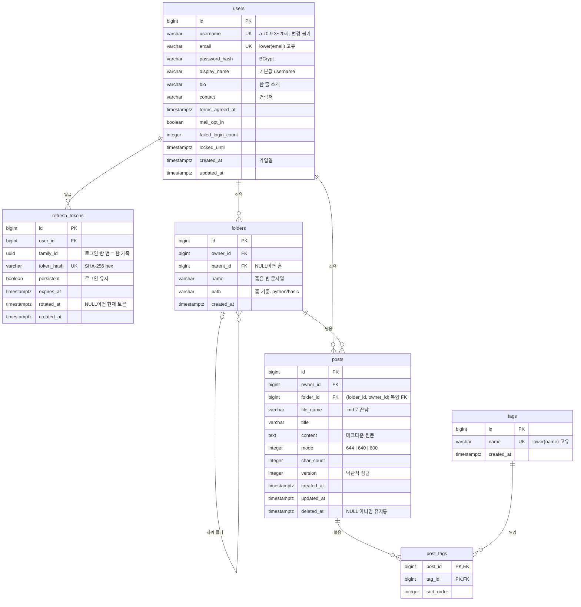

# c1oser.dev DB 설계 (ERD)

- 상태: 구현 반영 (2026-10-07). 스키마는 `V1__init.sql`로 만들었고 이 문서를 구현에 맞췄다.
- 범위: MVP(P0). P1 이후에 필요한 테이블은 8절에 방향만 적었다.
- 함께 읽을 문서: [기능 명세서](functional-spec.md), [MVP 범위](mvp-scope.md), [기술 스택 결정](tech-stack.md), [API 명세서](api-spec.md)
- 기준: PostgreSQL 18, Flyway. 6절의 DDL은 첫 마이그레이션 `src/main/resources/db/migration/V1__init.sql`과 같다. MVP 범위 5절의 "데이터 모델"을 구체화한 문서다.

## 1. 도메인과 테이블

| 도메인 | 테이블 | 요구사항 |
|---|---|---|
| user | `users` | AUTH-01, USER-01~03, ME-01~02 |
| auth | `refresh_tokens` | AUTH-02~05 |
| folder | `folders` | DIR-01~06 |
| post | `posts`, `post_tags` | POST-01~09, TAG-01 |
| tag | `tags` | TAG-01~02 |

`post_tags`는 "글에 붙은 태그 목록"이라 post 도메인이 쓴다. tag 도메인은 태그 이름표(`tags`)만 관리한다. 조회 전용 패키지(fs, search, profile)는 테이블을 갖지 않는다. 패키지 구조는 [API 명세서 2절](api-spec.md#2-패키지-구조)에 있다.

## 2. ERD



## 3. 공통 규칙

- 기본 키는 `BIGINT GENERATED ALWAYS AS IDENTITY`다. API에도 숫자로 노출한다.
- 시각은 모두 `TIMESTAMPTZ`다. 엔티티에서는 `Instant`로 받는다. `created_at`, `updated_at`은 애플리케이션이 채우고 트리거는 쓰지 않는다.
- 문자열은 NULL 대신 빈 문자열을 쓴다(`bio`, `contact`, `title`). "값 없음"이 한 가지뿐이라 API와 쿼리가 단순해진다.
- 정수 컬럼은 `INTEGER`, 문자열은 `VARCHAR`/`TEXT`만 쓴다. `CHAR`, `SMALLINT`은 엔티티 타입과 어긋나 Hibernate `ddl-auto=validate`에서 걸리기 쉬워 피했다.
- 본문(`posts.content`)에 `@Lob`을 붙이지 않는다. PostgreSQL에서 `@Lob String`은 `TEXT`가 아니라 large object(`oid`)로 매핑된다.
- 회원 탈퇴가 범위 밖이므로 `users`를 가리키는 외래 키는 기본(`NO ACTION`)이다. 예외는 `refresh_tokens`(`CASCADE`)다.

### 이름 규칙

폴더 이름, 파일 이름, 태그 이름은 명령어 인자로 쓰인다. 명령어는 공백으로 인자를 나누므로 공백을 허용하지 않는다. 한글은 허용한다.

| 대상 | 길이 | 허용하지 않는 것 | 기타 |
|---|---|---|---|
| 폴더 이름 | 1~50자 | `/`, 공백, 제어 문자. `.`으로 시작. `.md`로 끝남(대소문자 무시) | 같은 폴더 안에서 고유. 대소문자를 구분한다 |
| 파일 이름 | 4~100자 | `/`, 공백, 제어 문자. `.`으로 시작 | 소문자 `.md`로 끝난다. 같은 폴더 안 살아 있는 글끼리 고유. 대소문자를 구분한다 |
| 태그 이름 | 1~30자 | `#`, `/`, 공백, 제어 문자 | 서비스 전체에서 고유. 대소문자를 구분하지 않는다 |

- `.`으로 시작하는 이름은 시스템 폴더(`.trash`, `.replies`, `.mail`) 몫이다.
- 폴더 이름이 `.md`로 끝날 수 없으므로 "마지막 구간이 `.md`로 끝나면 글, 아니면 폴더"라는 경로 해석이 겹치지 않는다.

## 4. 테이블 정의

### 4.1 `users` (user)

| 컬럼 | 타입 | NULL | 기본값 | 설명 |
|---|---|---|---|---|
| id | BIGINT | ✕ | identity | |
| username | VARCHAR(20) | ✕ | | 아이디. `^[a-z0-9]{3,20}$`. 서버가 소문자로 바꿔 저장한다. 바꿀 수 없다 |
| email | VARCHAR(255) | ✕ | | 입력한 그대로 저장. 고유성은 `lower(email)` |
| password_hash | VARCHAR(100) | ✕ | | `DelegatingPasswordEncoder` 형식(`{bcrypt}$2a$...`) |
| display_name | VARCHAR(40) | ✕ | | 표시 이름. 가입 시 username으로 채운다 (기능 명세서 8절 2번) |
| bio | VARCHAR(100) | ✕ | `''` | 한 줄 소개 |
| contact | VARCHAR(100) | ✕ | `''` | 연락처. 본인 화면(홈, 마이페이지)에만 나온다 |
| terms_agreed_at | TIMESTAMPTZ | ✕ | | 필수 약관 동의 시각 |
| mail_opt_in | BOOLEAN | ✕ | false | 선택 동의. 값만 받아 둔다. 발송은 P2 (AUTH-10) |
| failed_login_count | INTEGER | ✕ | 0 | 연속 로그인 실패 횟수 |
| locked_until | TIMESTAMPTZ | ○ | | 로그인 잠금이 풀리는 시각 |
| created_at | TIMESTAMPTZ | ✕ | now() | 가입일 |
| updated_at | TIMESTAMPTZ | ✕ | now() | |

로그인 잠금 규칙 (기술 스택 3.3절 "로그인 시도 제한")

1. `locked_until`이 지금보다 뒤면 비밀번호를 확인하지 않고 거절한다.
2. 비밀번호가 틀리면 `failed_login_count`를 1 올린다. 5가 되면 `locked_until = now + 15분`으로 잠그고 횟수를 0으로 되돌린다. 잠금이 풀린 뒤 다시 5번의 기회가 생긴다.
3. 성공하면 `failed_login_count = 0`, `locked_until = NULL`.

남이 아이디만 알면 계정을 15분씩 잠글 수 있다. MVP에서는 받아들이고, 문제가 되면 IP 단위 제한을 더한다.

### 4.2 `refresh_tokens` (auth)

| 컬럼 | 타입 | NULL | 기본값 | 설명 |
|---|---|---|---|---|
| id | BIGINT | ✕ | identity | |
| user_id | BIGINT | ✕ | | → users.id, `ON DELETE CASCADE` |
| family_id | UUID | ✕ | | 로그인 한 번에 하나. 회전해도 유지된다 |
| token_hash | VARCHAR(64) | ✕ | | 토큰 원문의 SHA-256(hex). 원문은 쿠키에만 있다 |
| persistent | BOOLEAN | ✕ | | 로그인 유지 여부. 회전한 토큰도 같은 값을 물려받는다 |
| expires_at | TIMESTAMPTZ | ✕ | | 로그인 유지면 발급 후 30일, 아니면 24시간 |
| rotated_at | TIMESTAMPTZ | ○ | | 이 토큰으로 새 토큰을 받은 시각. NULL이면 가족의 현재 토큰 |
| created_at | TIMESTAMPTZ | ✕ | now() | |

제약: `UNIQUE (token_hash)`. 인덱스: `(family_id)`, `(user_id)`, `(expires_at)`.

회전과 재사용 감지 (API 명세서 5절 `POST /auth/refresh`)

| 받은 토큰의 상태 | 처리 |
|---|---|
| 없음, 또는 만료 | 401 |
| `rotated_at IS NULL` | `rotated_at = now()`로 표시하고, 같은 가족으로 새 행을 넣는다. 새 쿠키를 준다 |
| `rotated_at`이 30초 이내 | 다른 탭이 방금 회전한 경우다. 액세스 토큰만 새로 주고 쿠키는 건드리지 않는다. 브라우저에는 이미 새 쿠키가 있다 |
| `rotated_at`이 30초보다 전 | 이미 바뀐 토큰을 다시 쓴 것이라 탈취로 본다. 그 가족의 행을 모두 지우고 401 |

- 두 요청이 동시에 같은 토큰을 회전하지 않도록 `UPDATE ... SET rotated_at = :now WHERE id = ? AND rotated_at IS NULL`의 결과 행 수로 판정한다. `:now`는 애플리케이션의 시각이다. 0이면 위 표의 셋째·넷째 줄로 간다.
- 로그아웃은 받은 토큰의 가족을 모두 지운다.
- 만료된 행은 예약 작업이 지운다 (7절).

### 4.3 `folders` (folder)

| 컬럼 | 타입 | NULL | 기본값 | 설명 |
|---|---|---|---|---|
| id | BIGINT | ✕ | identity | |
| owner_id | BIGINT | ✕ | | → users.id |
| parent_id | BIGINT | ○ | | → folders.id. NULL이면 그 사용자의 홈(`~`) |
| name | VARCHAR(50) | ✕ | | 홈은 `''` |
| path | VARCHAR(600) | ✕ | | 홈 기준 경로. 홈은 `''`, 그 아래는 `python`, `python/basic`. 앞뒤에 `/`가 없다 |
| created_at | TIMESTAMPTZ | ✕ | now() | |

제약

| 제약 | 뜻 |
|---|---|
| `UNIQUE (parent_id, name)` | 같은 폴더 안에서 이름이 겹치지 않는다 |
| `UNIQUE (owner_id, path)` | 경로 조회의 키 |
| `UNIQUE INDEX (owner_id) WHERE parent_id IS NULL` | 홈은 사용자마다 하나 |
| `UNIQUE (id, owner_id)` | 아래 복합 외래 키의 대상 |
| `FOREIGN KEY (parent_id, owner_id) → folders (id, owner_id)` | 하위 폴더는 부모와 소유자가 같다 |
| `CHECK` 홈 | 홈이면 `name = '' AND path = ''`, 아니면 둘 다 비어 있지 않다 |
| `CHECK` 이름 | 3절의 이름 규칙 |

인덱스: `path`에 `pg_trgm` GIN (`find`가 경로로 찾는다).

- 홈 폴더는 회원가입 트랜잭션에서 함께 만든다.
- `path`는 서비스가 `parent.path + '/' + name`으로 계산해 넣는다. MVP에는 폴더 이름 변경과 이동이 없으므로(기능 명세서 8절 9번) 한 번 정해지면 바뀌지 않는다. 그래서 `updated_at`도 두지 않는다.
- **깊이는 홈 아래 10단계까지**다. 이름 50자 × 10단계 + 구분자 9개 = 509자라 `VARCHAR(600)`을 넘지 않는다. 깊이는 API가 검사한다.
- **트리는 애플리케이션에서 조립한다.** `owner_id`로 그 사람의 폴더를 모두 읽어 메모리에서 부모-자식으로 엮는다. 한 사람의 폴더는 수십 개 수준이라 재귀 CTE보다 단순하다.
- 폴더 색은 저장하지 않는다. 프런트가 `created_at` 순서로 팔레트를 돌려 쓴다 (기능 명세서 8절 11번).

### 4.4 `posts` (post)

| 컬럼 | 타입 | NULL | 기본값 | 설명 |
|---|---|---|---|---|
| id | BIGINT | ✕ | identity | |
| owner_id | BIGINT | ✕ | | → users.id |
| folder_id | BIGINT | ✕ | | → folders.id. 홈에 바로 둔 글은 홈 폴더를 가리킨다 |
| file_name | VARCHAR(100) | ✕ | | 3절의 이름 규칙 |
| title | VARCHAR(200) | ✕ | `''` | front matter의 `title`. 비어 있으면 화면은 파일 이름을 보여 준다 |
| content | TEXT | ✕ | `''` | 마크다운 원문. front matter는 넣지 않는다 (기술 스택 3.5절). UTF-8 1MB 이하 |
| mode | INTEGER | ✕ | 644 | 644(로그인한 누구나), 640(링크, P1), 600(나만) |
| char_count | INTEGER | ✕ | 0 | 공백·줄바꿈을 뺀 글자(코드 포인트) 수. 저장할 때 계산한다 |
| version | INTEGER | ✕ | 0 | JPA `@Version`. 고칠 때마다 1 오른다 |
| created_at | TIMESTAMPTZ | ✕ | now() | 작성일 |
| updated_at | TIMESTAMPTZ | ✕ | now() | 수정일. 제목·본문·태그·이름·위치·공개 범위가 바뀌면 갱신 |
| deleted_at | TIMESTAMPTZ | ○ | | NULL이 아니면 휴지통. 30일 뒤 예약 작업이 행을 지운다 |

제약

| 제약 | 뜻 |
|---|---|
| `FOREIGN KEY (folder_id, owner_id) → folders (id, owner_id)` | 글의 소유자는 폴더의 소유자와 같다. `mv`로 남의 폴더에 옮길 수 없다 |
| `UNIQUE INDEX (folder_id, file_name) WHERE deleted_at IS NULL` | 살아 있는 글끼리만 이름이 겹치지 않는다. 휴지통에 `pointer.md`가 있어도 새 `pointer.md`를 만들 수 있다 |
| `CHECK (mode IN (644, 640, 600))` | 640은 P1이지만 마이그레이션을 줄이려고 DB는 미리 허용한다. API는 P0에서 644, 600만 받는다 |
| `CHECK (octet_length(content) <= 1048576)` | 본문 1MB |
| `CHECK` 파일 이름 | 3절의 이름 규칙 |

인덱스

| 인덱스 | 쓰는 곳 |
|---|---|
| `(folder_id)` | `rmdir`의 빈 폴더 검사. 휴지통 글도 센다 |
| `(owner_id, updated_at DESC, id DESC) WHERE deleted_at IS NULL` | 그 사람의 글 목록(최근 수정순), 글 수 |
| `(owner_id, deleted_at DESC) WHERE deleted_at IS NOT NULL` | 휴지통 목록, 자동 비우기 |
| `content` GIN `gin_trgm_ops` | `grep` |
| `file_name` GIN `gin_trgm_ops` | `find` |

결정

- **`owner_id`를 중복으로 둔다.** 폴더를 거치지 않고 소유자 확인, 글 수 집계, 검색 범위를 거른다. 복합 외래 키가 폴더의 소유자와 어긋나지 않게 막는다.
- **휴지통은 `deleted_at`이다.** 휴지통에 있는 동안 `folder_id`를 유지하므로 복구하면 원래 자리로 간다. 그 자리에 같은 이름의 글이 생겨 있으면 API가 409로 거절하고 다른 이름으로 복구하게 한다.
- **`rmdir`은 휴지통 글도 센다.** 휴지통 글이 남은 폴더를 지우면 복구할 곳이 없어지기 때문이다.
- **동시 수정은 `version`으로 막는다.** 두 탭에서 같은 글을 고치면 나중에 저장한 쪽이 409를 받는다 (API 명세서 8절).

### 4.5 `tags` (tag), `post_tags` (post)

`tags`

| 컬럼 | 타입 | NULL | 기본값 | 설명 |
|---|---|---|---|---|
| id | BIGINT | ✕ | identity | |
| name | VARCHAR(30) | ✕ | | `#` 없이 저장. 처음 쓴 사람의 표기를 유지한다 |
| created_at | TIMESTAMPTZ | ✕ | now() | |

제약: `UNIQUE INDEX (lower(name))`, `CHECK` 이름 규칙. 인덱스: `lower(name) text_pattern_ops` (자동완성의 앞부분 일치).

`post_tags`

| 컬럼 | 타입 | NULL | 설명 |
|---|---|---|---|
| post_id | BIGINT | ✕ | → posts.id, `ON DELETE CASCADE` |
| tag_id | BIGINT | ✕ | → tags.id |
| sort_order | INTEGER | ✕ | 글쓴이가 단 순서 (front matter `tags: [...]`의 순서) |

제약: `PRIMARY KEY (post_id, tag_id)`. 인덱스: `(tag_id, post_id)`.

- 태그는 서비스 전체가 함께 쓴다. TAG-02의 태그별 글 목록이 사람을 넘어서기 때문이다.
- 새 태그는 `INSERT INTO tags (name, created_at) VALUES (:name, :now) ON CONFLICT ((lower(name))) DO NOTHING` 뒤에 대소문자 무시로 다시 읽는다 (`TagRepository.insertIfAbsent`). 두 글이 같은 새 태그를 동시에 만들어도 오류가 나지 않는다.
- 글에서 떼거나 글이 지워져도 `tags` 행은 남긴다. 글이 0개인 태그는 조회에서 뺀다.

## 5. 조회 규칙

### 5.1 읽기 권한

글을 보여 주거나 세는 모든 쿼리는 같은 조건을 쓴다 (기능 명세서 6절 "존재 비노출").

```sql
p.deleted_at IS NULL AND (p.owner_id = :viewerId OR p.mode = 644)
```

이 조건은 post 도메인의 `PostVisibility` 한 곳에 둔다. 상수가 셋이다.

| 상수 | 쓰는 곳 |
|---|---|
| `READABLE_JPQL` | post 저장소의 JPQL (`findReadableByOwner`, `findReadableInFolderByName` 등) |
| `READABLE_SQL` | 위 조건의 네이티브 SQL. fs(폴더별 글 수), search, profile(사람의 글 수) |
| `PUBLIC_SQL` | `p.deleted_at IS NULL AND p.mode = 644`. 보는 사람과 상관없는 공개 글. 사람 목록의 글 수처럼 누가 봐도 같아야 하는 값에 쓴다 |

읽을 수 있는 글만 고르는 저장소 메서드 이름에는 `Readable`을 붙인다.

### 5.2 경로와 테이블

| 경로 | 조회 |
|---|---|
| `~` | 내 `folders` 중 `parent_id IS NULL` |
| `~/python/basic` | `folders` where `owner_id = 나 AND path = 'python/basic'` |
| `~/python/pointer.md` | `folders`의 `python` + `posts` where `folder_id = 그 폴더 AND file_name = 'pointer.md'` + 읽기 권한 |
| `/users/kim/...` | `users.username = 'kim'`으로 소유자를 찾고 위와 같다 |
| `~/.trash` | `posts` where `owner_id = 나 AND deleted_at IS NOT NULL`. 폴더 행이 없다 |
| `/users` | `users` 목록. 폴더가 아니다 |

### 5.3 검색 (`pg_trgm`)

- `content ILIKE :pattern ESCAPE '\'`를 GIN 인덱스로 거른다. `:pattern`은 `%검색어%`이고, 검색어의 `\`, `%`, `_`는 앞에 `\`를 붙여 글자로 만든다. 이 처리는 `common/sql/LikePatterns` 한 곳에 있고 내용 검색, 이름 검색(`file_name`, `path`), 태그 자동완성(`lower(name) LIKE '검색어%'`), 사람 찾기(`username`, `display_name`)가 모두 쓴다.
- **검색어가 3글자 이상이어야 인덱스를 쓴다.** 2글자(`포인`)는 trigram이 나오지 않아 순차 조회가 된다. 한국어는 2글자 단어가 많으므로 2글자를 허용하되, 느려지는지 k6로 확인한다 (기술 스택 3.11절). 내용 검색은 1글자를 받지 않는다. 이름 검색(`find`)과 태그 자동완성은 1글자도 받으므로 1~2글자 이름 검색은 순차 조회가 된다.
- `pg_trgm`은 DB의 `LC_CTYPE`으로 글자와 기호를 가른다. `C` 로케일에서는 한글이 trigram에서 빠질 수 있다. 공식 Docker 이미지는 `en_US.utf8`이다. 운영 DB도 UTF-8 로케일이어야 한다. Testcontainers의 DB가 UTF-8이고 한글 검색어(`%포인터%`, `%자료구조%`)가 `ix_posts_content_trgm`, `ix_posts_file_name_trgm`, `ix_folders_path_trgm`을 쓸 수 있는 것을 `EXPLAIN`으로 확인했다 (`SearchTest.koreanSearchCanUseTrigramIndexes`). 데이터가 적으면 순차 조회가 더 싸므로 테스트에서는 `enable_seqscan`을 끄고 본다.

## 6. DDL (`V1__init.sql`)

```sql
CREATE EXTENSION IF NOT EXISTS pg_trgm;

-- user
CREATE TABLE users (
    id                 BIGINT GENERATED ALWAYS AS IDENTITY PRIMARY KEY,
    username           VARCHAR(20)  NOT NULL,
    email              VARCHAR(255) NOT NULL,
    password_hash      VARCHAR(100) NOT NULL,
    display_name       VARCHAR(40)  NOT NULL,
    bio                VARCHAR(100) NOT NULL DEFAULT '',
    contact            VARCHAR(100) NOT NULL DEFAULT '',
    terms_agreed_at    TIMESTAMPTZ  NOT NULL,
    mail_opt_in        BOOLEAN      NOT NULL DEFAULT FALSE,
    failed_login_count INTEGER      NOT NULL DEFAULT 0,
    locked_until       TIMESTAMPTZ,
    created_at         TIMESTAMPTZ  NOT NULL DEFAULT now(),
    updated_at         TIMESTAMPTZ  NOT NULL DEFAULT now(),
    CONSTRAINT uq_users_username UNIQUE (username),
    CONSTRAINT ck_users_username CHECK (username ~ '^[a-z0-9]{3,20}$'),
    CONSTRAINT ck_users_display_name CHECK (display_name <> ''),
    CONSTRAINT ck_users_failed_login_count CHECK (failed_login_count >= 0)
);
CREATE UNIQUE INDEX uq_users_email ON users (lower(email));

-- auth
CREATE TABLE refresh_tokens (
    id         BIGINT GENERATED ALWAYS AS IDENTITY PRIMARY KEY,
    user_id    BIGINT      NOT NULL REFERENCES users (id) ON DELETE CASCADE,
    family_id  UUID        NOT NULL,
    token_hash VARCHAR(64) NOT NULL,
    persistent BOOLEAN     NOT NULL,
    expires_at TIMESTAMPTZ NOT NULL,
    rotated_at TIMESTAMPTZ,
    created_at TIMESTAMPTZ NOT NULL DEFAULT now(),
    CONSTRAINT uq_refresh_tokens_token_hash UNIQUE (token_hash)
);
CREATE INDEX ix_refresh_tokens_family     ON refresh_tokens (family_id);
CREATE INDEX ix_refresh_tokens_user       ON refresh_tokens (user_id);
CREATE INDEX ix_refresh_tokens_expires_at ON refresh_tokens (expires_at);

-- folder
CREATE TABLE folders (
    id         BIGINT GENERATED ALWAYS AS IDENTITY PRIMARY KEY,
    owner_id   BIGINT       NOT NULL REFERENCES users (id),
    parent_id  BIGINT,
    name       VARCHAR(50)  NOT NULL,
    path       VARCHAR(600) NOT NULL,
    created_at TIMESTAMPTZ  NOT NULL DEFAULT now(),
    CONSTRAINT uq_folders_id_owner    UNIQUE (id, owner_id),
    CONSTRAINT uq_folders_parent_name UNIQUE (parent_id, name),
    CONSTRAINT uq_folders_owner_path  UNIQUE (owner_id, path),
    CONSTRAINT fk_folders_parent FOREIGN KEY (parent_id, owner_id) REFERENCES folders (id, owner_id),
    CONSTRAINT ck_folders_root CHECK (
        (parent_id IS NULL     AND name = ''  AND path = '')
     OR (parent_id IS NOT NULL AND name <> '' AND path <> '')
    ),
    CONSTRAINT ck_folders_name CHECK (
        name !~ '[/[:space:][:cntrl:]]' AND name !~ '^\.' AND name !~* '\.md$'
    )
);
CREATE UNIQUE INDEX uq_folders_root     ON folders (owner_id) WHERE parent_id IS NULL;
CREATE INDEX        ix_folders_path_trgm ON folders USING gin (path gin_trgm_ops);

-- post
CREATE TABLE posts (
    id         BIGINT GENERATED ALWAYS AS IDENTITY PRIMARY KEY,
    owner_id   BIGINT       NOT NULL REFERENCES users (id),
    folder_id  BIGINT       NOT NULL,
    file_name  VARCHAR(100) NOT NULL,
    title      VARCHAR(200) NOT NULL DEFAULT '',
    content    TEXT         NOT NULL DEFAULT '',
    mode       INTEGER      NOT NULL DEFAULT 644,
    char_count INTEGER      NOT NULL DEFAULT 0,
    version    INTEGER      NOT NULL DEFAULT 0,
    created_at TIMESTAMPTZ  NOT NULL DEFAULT now(),
    updated_at TIMESTAMPTZ  NOT NULL DEFAULT now(),
    deleted_at TIMESTAMPTZ,
    CONSTRAINT fk_posts_folder FOREIGN KEY (folder_id, owner_id) REFERENCES folders (id, owner_id),
    CONSTRAINT ck_posts_file_name CHECK (
        file_name ~ '^[^/.[:space:][:cntrl:]][^/[:space:][:cntrl:]]*\.md$'
    ),
    CONSTRAINT ck_posts_mode CHECK (mode IN (644, 640, 600)),
    CONSTRAINT ck_posts_content_size CHECK (octet_length(content) <= 1048576)
);
CREATE UNIQUE INDEX uq_posts_folder_file_name ON posts (folder_id, file_name) WHERE deleted_at IS NULL;
CREATE INDEX ix_posts_folder         ON posts (folder_id);
CREATE INDEX ix_posts_owner_updated  ON posts (owner_id, updated_at DESC, id DESC) WHERE deleted_at IS NULL;
CREATE INDEX ix_posts_owner_deleted  ON posts (owner_id, deleted_at DESC) WHERE deleted_at IS NOT NULL;
CREATE INDEX ix_posts_content_trgm   ON posts USING gin (content gin_trgm_ops);
CREATE INDEX ix_posts_file_name_trgm ON posts USING gin (file_name gin_trgm_ops);

-- tag
CREATE TABLE tags (
    id         BIGINT GENERATED ALWAYS AS IDENTITY PRIMARY KEY,
    name       VARCHAR(30) NOT NULL,
    created_at TIMESTAMPTZ NOT NULL DEFAULT now(),
    CONSTRAINT ck_tags_name CHECK (name ~ '^[^#/[:space:][:cntrl:]]+$')
);
CREATE UNIQUE INDEX uq_tags_name        ON tags (lower(name));
CREATE INDEX        ix_tags_name_prefix ON tags (lower(name) text_pattern_ops);

CREATE TABLE post_tags (
    post_id    BIGINT  NOT NULL REFERENCES posts (id) ON DELETE CASCADE,
    tag_id     BIGINT  NOT NULL REFERENCES tags (id),
    sort_order INTEGER NOT NULL,
    PRIMARY KEY (post_id, tag_id)
);
CREATE INDEX ix_post_tags_tag ON post_tags (tag_id, post_id);
```

### 제약 위반과 API 오류

서비스가 먼저 검사하더라도 동시 요청은 DB 제약에서 걸린다. `GlobalExceptionHandler`는 제약 이름으로 오류 코드를 정한다. 표에 없는 제약 위반은 500이다.

| 제약 | API 오류 |
|---|---|
| `uq_users_username` | 409 `USERNAME_TAKEN` |
| `uq_users_email` | 409 `EMAIL_TAKEN` |
| `uq_folders_parent_name`, `uq_folders_owner_path` | 409 `FOLDER_NAME_TAKEN` |
| `uq_posts_folder_file_name` | 409 `POST_NAME_TAKEN` |
| `ck_*` | 400 `VALIDATION_ERROR` (API 검증이 먼저 막으므로 나오면 검증 누락이다) |

제약은 아니지만 같은 곳에서 `@Version` 충돌(낙관적 잠금 실패)을 409 `POST_VERSION_CONFLICT`로 바꾼다.

## 7. 예약 작업

| 작업 | 쿼리 | 주기 | 위치 |
|---|---|---|---|
| 휴지통 비우기 (POST-09) | `DELETE FROM posts WHERE deleted_at < :before` (`:before` = 지금 − 30일) | 매일 04:00 (Asia/Seoul) | post |
| 만료 토큰 정리 | `DELETE FROM refresh_tokens WHERE expires_at < :now` | 매일 04:10 (Asia/Seoul) | auth |

`@Scheduled`이고 서버 한 대를 전제한다 (기술 스택 3.6절). 기준 시각은 DB의 `now()`가 아니라 애플리케이션의 `Clock`이다. `post_tags`는 `CASCADE`로 함께 지워진다.

## 8. P1 이후 확장 방향

P0 스키마에 미리 넣지 않는다. 지금 구조에 자리가 있는지만 확인했다.

| 기능 | 방향 |
|---|---|
| 답글 (REPLY-01~03) | `posts`에 `reply_to_post_id`를 더한다. 답글도 쓴 사람의 글이고(MVP 범위 6절 6번), 원글이 휴지통에 가면 함께 `deleted_at`을 채운다. `~/.replies`는 `reply_to_post_id IS NOT NULL`인 내 글의 가상 폴더다 |
| 링크 공개 640 (POST-13) | `share_links(post_id, token_hash, created_at)`. 읽기 권한에 `mode = 640 AND 토큰 일치`를 더한다 |
| 위키 링크·백링크 (LINK-01~02) | `post_links(from_post_id, to_post_id NULL, to_path)`. 저장할 때 본문의 `[[...]]`를 읽어 채운다 |
| 구독·피드 (USER-04~06) | `follows(follower_id, followee_id, created_at)` |
| 알림 (NOTI-01~04) | `notifications(id, user_id, type, actor_id, post_id, read_at, created_at)`, `notification_settings(user_id, type, enabled)` |
| 북마크 (ME-04) | `bookmarks(user_id, kind, target_id, created_at)` |
| 쓴 날·통계 (ME-03, 05) | `posts.created_at` 집계. 테이블을 더하지 않는다 |
| 복사 (POST-14) | `posts.copied_from_post_id` |
| 폴더 이름 변경·이동 | 하위 폴더의 `path`를 한 트랜잭션에서 `path LIKE '옛경로/%'`로 함께 고친다 |
| 변경 비교 (POST-16) | `post_revisions(post_id, version, title, content, saved_at)` |
| `ln -s` (POST-17) | `folder_links(folder_id, post_id)`. `posts.folder_id`는 원본 위치로 남는다 |

## 9. 설계 결정

| # | 항목 | 결정 | 이유 |
|---|---|---|---|
| 1 | 홈 폴더 | 사용자마다 `parent_id IS NULL`인 행을 둔다 | 글의 `folder_id`가 항상 NOT NULL이고, 홈에 둔 글도 같은 규칙을 따른다 |
| 2 | 폴더 경로 | `path`를 저장한다 | 경로 조회가 쿼리 한 번이고 `find`가 경로로 찾는다. MVP에 폴더 이름 변경이 없다 |
| 3 | 소유자 일치 | 복합 외래 키 `(folder_id, owner_id)`, `(parent_id, owner_id)` | 서비스 코드의 실수로도 남의 폴더에 글이나 폴더가 들어가지 않는다 |
| 4 | 공개 범위 | `INTEGER` 644/640/600 | `chmod`와 화면 표기가 그대로 숫자다 |
| 5 | 아이디·이메일 | 아이디는 소문자로 저장, 이메일은 원문 저장 + `lower()` 고유 | `/users/{username}`이 대소문자와 무관하고, 이메일은 입력한 대로 보인다 |
| 6 | 빈 값 | 문자열은 NULL 대신 `''` | "값 없음"이 한 가지다 |
| 7 | 파일 이름 고유성 | 부분 고유 인덱스 (`deleted_at IS NULL`) | 휴지통의 글이 새 글 이름을 막지 않는다 |
| 8 | 동시 수정 | `posts.version` 낙관적 잠금 | 두 탭에서 고치면 앞의 저장이 소리 없이 사라지는 것을 막는다 |
| 9 | 리프레시 토큰 | 가족 단위 회전 + 30초 유예 + 재사용 시 가족 폐기 | 여러 탭이 동시에 갱신해도 로그아웃되지 않고, 탈취된 토큰의 재사용은 잡아낸다 |
| 10 | 로그인 잠금 | `users`의 컬럼 2개, 잠글 때 횟수 초기화 | 별도 테이블 없이 계정 단위로 충분하다 |
| 11 | 폴더 깊이 | 10단계, 이름 50자 | `path` 길이의 상한이 정해진다 |
| 12 | 트리 조회 | 전체를 읽어 애플리케이션에서 조립 | 한 사람의 폴더 수가 작다. 재귀 CTE가 필요 없다 |
| 13 | 삭제 | 사용자는 지우지 않는다. 글은 휴지통 30일 뒤 행 삭제 | 탈퇴는 범위 밖. 휴지통 요구사항 그대로 |
