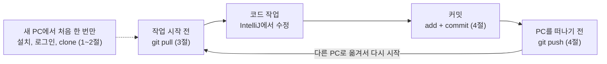

# 여러 PC에서 GitHub 프로젝트 작업하기

PC를 옮겨 다니며 이 프로젝트를 작업할 때 따라 하는 가이드입니다.

## 목차

- [한눈에 보기](#한눈에-보기)
- [1. 새 PC 처음 설정 (PC마다 한 번만)](#1-새-pc-처음-설정-pc마다-한-번만)
- [2. 프로젝트 처음 받기 (PC마다 한 번만)](#2-프로젝트-처음-받기-pc마다-한-번만)
- [3. 작업 시작 전: 최신 내용 받기 (매번)](#3-작업-시작-전-최신-내용-받기-매번)
- [4. 작업 끝난 후: 커밋하고 올리기 (매번)](#4-작업-끝난-후-커밋하고-올리기-매번)
- [5. 커밋 메시지 쓰는 법](#5-커밋-메시지-쓰는-법)
- [6. 자주 겪는 문제와 해결](#6-자주-겪는-문제와-해결)

## 한눈에 보기



새 PC에서 한 번만 설정하고 나면, 어느 PC에서든 pull, 작업, 커밋, push 순서만 지키면 됩니다.
시작할 때 pull, 떠나기 전에 push 두 가지만은 절대 빠뜨리지 마세요.

## 1. 새 PC 처음 설정 (PC마다 한 번만)

처음 쓰는 PC에서만 한 번 하면 됩니다. 이미 설정한 PC라면 3번으로 건너뛰세요.
명령은 모두 PowerShell이나 Git Bash에서 입력합니다.

**1) Git과 GitHub CLI 설치.** 설치가 끝나면 터미널을 껐다가 다시 켜세요.

```powershell
winget install --id Git.Git -e
winget install --id GitHub.cli -e
```

**2) 내 이름과 이메일 등록.** 커밋에 작성자로 기록됩니다.

```powershell
git config --global user.name "g2jkj0274"
git config --global user.email "g2jkj0274@gmail.com"
git config --global pull.rebase false
```

세 번째 줄은 pull 할 때 "브랜치를 어떻게 합칠지 정하라"는 오류가 나지 않게 해 줍니다.

**3) GitHub 로그인.** 화면에 나오는 코드를 복사하고, 열리는 브라우저 창에 붙여 넣으면 됩니다.

```powershell
gh auth login -h github.com -w
gh auth setup-git
```

두 번째 줄은 git이 이 로그인 정보로 push 하도록 연결합니다. 이걸 빠뜨리면 push 할 때 인증 오류가 납니다.

**4) IntelliJ IDEA와 JDK 21 준비.** 프로젝트가 Java 21을 씁니다.
JDK가 없으면 IntelliJ가 프로젝트를 열 때 설치를 제안하니 그대로 따르면 됩니다.

**5) Docker Desktop 설치.** 테스트(Testcontainers)와 개발용 DB가 Docker로 PostgreSQL을 띄웁니다. Docker가 없으면 테스트도 앱 실행도 실패합니다.

```powershell
winget install --id Docker.DockerDesktop -e
```

설치가 끝나면 Docker Desktop을 한 번 실행합니다. 재부팅이나 WSL 업데이트를 하라고 하면 그대로 따르세요.

설정이 잘 됐는지는 아래 명령으로 확인합니다. `Logged in to github.com account g2jkj0274`가 보이고, `docker version`에 `Server:` 부분까지 나오면 성공입니다.

```powershell
gh auth status
docker version
```

## 2. 프로젝트 처음 받기 (PC마다 한 번만)

GitHub의 프로젝트를 내 PC로 통째로 복사하는 것을 clone이라고 합니다.
아래는 바탕화면의 closer 폴더에 blog-server라는 이름으로 받는 예시입니다.

```powershell
cd ~\Desktop
mkdir closer
cd closer
git clone https://github.com/g2jkj0274/closer-blog-backend.git blog-server
```

- 저장소: [g2jkj0274/closer-blog-backend](https://github.com/g2jkj0274/closer-blog-backend)
- 끝의 blog-server는 내 PC에 만들 폴더 이름입니다. 빼면 closer-blog-backend 폴더로 받습니다.
- closer 폴더가 이미 있으면 mkdir 줄은 건너뛰세요.

**IntelliJ에서 열기:** File 메뉴의 Open을 누르고 blog-server 폴더를 고릅니다.
Gradle 프로젝트로 자동 인식되고, 오른쪽 아래에서 의존성 다운로드가 끝날 때까지 기다리면 됩니다.

.idea 폴더 같은 IntelliJ 개인 설정은 GitHub에 올리지 않습니다.
그래서 새 PC에서는 실행 설정이나 코드 스타일을 다시 맞춰야 할 수 있습니다.

**잘 받았는지 확인:** Docker Desktop이 켜져 있는지 확인하고 IntelliJ 터미널에서 테스트를 돌립니다.
처음에는 PostgreSQL 이미지와 의존성을 받느라 몇 분 걸립니다. `BUILD SUCCESSFUL`이 나오면 됩니다.

```powershell
./gradlew test
```

앱 실행, Swagger, 모니터링을 띄우는 방법은 [README](../README.md)의 "실행 방법"에 있습니다.

## 3. 작업 시작 전: 최신 내용 받기 (매번)

코드를 고치기 전에 반드시 pull 부터 합니다. 다른 PC에서 push 한 내용을 이 PC로 가져오는 단계입니다.

```powershell
cd ~\Desktop\closer\blog-server
git status
git pull
```

1. `git status`는 현재 상태를 보여 줍니다. `nothing to commit, working tree clean`이면 pull 해도 안전합니다.
2. `git pull`은 GitHub의 최신 커밋을 받아옵니다. `Already up to date.`가 나오면 이미 최신입니다.

IntelliJ에서는 Ctrl+T(Update Project)가 pull과 같은 일을 합니다.

## 4. 작업 끝난 후: 커밋하고 올리기 (매번)

PC를 떠나기 전에 반드시 push 까지 끝내세요. push 하지 않은 작업은 그 PC에만 남아서 다른 PC에서 받을 수 없습니다.

```powershell
git status
git add .
git commit -m "feat: 게시글 목록 조회 API 추가"
git push
```

1. `git status`로 바뀐 파일을 확인합니다. 올리면 안 되는 파일(비밀번호, 개인 설정)이 있는지 봅니다.
2. `git add .`는 바뀐 파일을 전부 커밋 대상에 올립니다.
3. `git commit -m "..."`은 올린 변경을 하나의 기록으로 저장합니다. 메시지 쓰는 법은 다음 절에 있습니다.
4. `git push`는 저장한 커밋을 GitHub에 올립니다.

마지막으로 `git status`를 한 번 더 실행해서 `Your branch is up to date with 'origin/main'`이 보이면 끝입니다.

IntelliJ에서는 Ctrl+K로 커밋 창을 열고, Ctrl+Shift+K로 push 합니다.
커밋 창의 Commit and Push 버튼을 누르면 두 단계를 한 번에 합니다.

## 5. 커밋 메시지 쓰는 법

메시지는 `타입: 무엇을 했는지` 형식으로 씁니다. 가장 널리 쓰이는 Conventional Commits 방식입니다.

| 타입 | 언제 쓰나 | 예시 |
| --- | --- | --- |
| feat | 새 기능 추가 | feat: 회원가입 API 추가 |
| fix | 버그 수정 | fix: 댓글 삭제 시 500 오류 수정 |
| refactor | 동작은 그대로, 코드 구조만 개선 | refactor: 게시글 서비스 메서드 분리 |
| test | 테스트 추가나 수정 | test: 로그인 실패 케이스 테스트 추가 |
| docs | 문서 수정 | docs: README에 실행 방법 추가 |
| chore | 빌드, 설정, 의존성 같은 기타 작업 | chore: JPA 의존성 추가 |

- 한 커밋에는 한 가지 일만 담는 것이 좋습니다.
- 요약은 50자 안쪽으로 짧게 쓰고, 끝에 마침표를 붙이지 않습니다.
- 하루 작업을 한 번에 올릴 때 딱 맞는 타입이 없으면, 가장 큰 변경의 타입을 고릅니다.

## 6. 자주 겪는 문제와 해결

대부분의 문제는 pull을 잊었거나 push를 잊었을 때 생깁니다. 오류 메시지에 나온 문구로 아래에서 찾아 보세요.

### push 할 때 Authentication failed

로그인 정보가 만료된 것입니다. 다시 로그인하고 push 합니다.

```powershell
gh auth login -h github.com -w
gh auth setup-git
git push
```

### push 할 때 rejected, fetch first

다른 PC에서 올린 커밋을 이 PC가 아직 받지 않은 상태입니다. 먼저 받고 다시 올립니다.

```powershell
git pull
git push
```

pull 도중 에디터 창이 열리면 합치기 커밋 메시지를 묻는 것입니다. 그대로 저장하고 닫으면 됩니다.

### pull 할 때 Your local changes would be overwritten

pull 전에 이미 코드를 고친 상태입니다. 고친 내용을 잠시 치워 두고 받은 뒤 다시 꺼냅니다.

```powershell
git stash
git pull
git stash pop
```

### CONFLICT 메시지 (충돌)

두 PC에서 같은 파일의 같은 줄을 다르게 고친 경우입니다. git이 어느 쪽을 남길지 묻는 것이라 직접 골라야 합니다.

1. 충돌한 파일을 열면 `<<<<<<<`, `=======`, `>>>>>>>` 표시가 보입니다. 위쪽이 이 PC의 내용, 아래쪽이 GitHub의 내용입니다.
2. 남길 내용만 남기고 표시 세 줄을 지웁니다. IntelliJ의 Resolve 버튼을 쓰면 양쪽을 나란히 보며 고를 수 있어 더 쉽습니다.
3. 정리가 끝나면 커밋하고 올립니다.

```powershell
git add .
git commit -m "fix: 충돌 해결"
git push
```

### 이전 PC에서 push를 잊음

GitHub에서는 받을 방법이 없습니다. 이전 PC로 돌아가서 4번의 push를 해야 합니다.
그사이 새 PC에서 같은 파일을 고치면 나중에 충돌이 날 수 있습니다.

### LF will be replaced by CRLF 경고

Windows와 다른 OS의 줄바꿈 방식 차이를 알려 주는 경고입니다. 작업에는 영향이 없으니 무시해도 됩니다.
